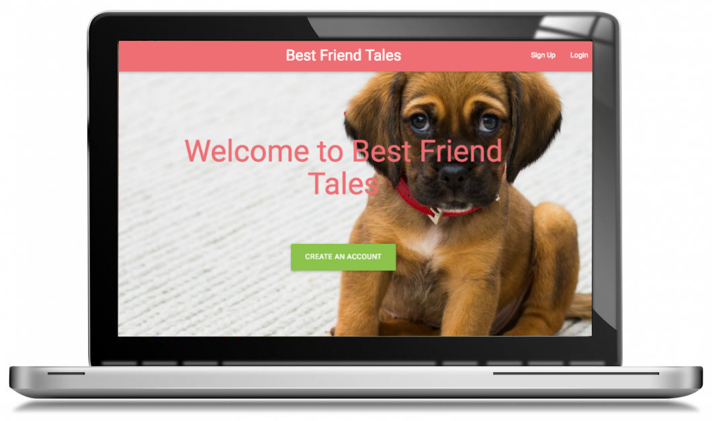

# Best Friend Tales

Approximately 7.6 million companion animals enter animal shelters nationwide every year. Of those, approximately 3.9 million are dogs and 3.4 million are cats. And each year, approximately 2.7 million animals are euthanized (1.2 million dogs and 1.4 million cats).

[Best Friend Tales](http://bftales.com) was built to help solve this problem. 

Find a local pet (dog, cat, bird, mouse, and much more) in need of a home and blog about their tale as they join your family.

## Features

- Search of adoptable pets loaded on Petfinder and add them to your profile
- Search for local pets based on user location
- See contact information to adopt a pet
- Contact shelters directly through the website regarding adoption with pre-written email from users email account
- Add Pets to user profiles
- Create and edit posts
- Comment on posts
- See all comments and posts for every user
- See other users pets
- Mobile very-friendly
- Sentiment Analysis on the comments of a user's posts



## Getting Started: Sinatra

1. Fork the Repo

2. Clone the Repo down to your machine

3. ```cd``` into the Repo

4. ```cd sinatra_version```

5. ```bundle install```

6. ```bundle exec rake db:setup```

7. ```bundle exec shotgun```

Your app will now be running on [localhost:9393](http://localhost:9393).

#### To set your environment variables with the Sinatra version, follow these steps:

1. Create a .env file in the /sinatra_version directory

2. Add these environment variables inside the file (with your keys):

```
PETFINDER_KEY=aaabababababaaaab2342342342342
PETFINDER_SECRET=aaabababababaaaab2342342342342
SENDGRID_APIKEY=aaabababababaaaab2342342342342
SENDGRID_PASSWORD=aaabababababaaaab2342342342342
SENDGRID_USERNAME=someherokuapp@heroku.com
```

3. Restart your server and run ```be shotgun```

## Getting Started: Rails (ALPHA)

1. Fork the Repo

2. Clone the Repo down to your machine

3. ```cd``` into the Repo

4. ```cd rails_version```

5. ```bundle install```

6. ```bundle exec rake db:setup```

7. ```bundle exec rails server```

Your app will now be running on [localhost:3000](http://localhost:3000).

#### To set your environment variables with the Rails version, follow these steps:

1. From rails_version directory, ```cd config```

2. Create a file called application.yml

3. Add these environment variables inside the application.yml (with your keys):

```
PETFINDER_KEY: aaabababababaaaab2342342342342
PETFINDER_SECRET: aaabababababaaaab2342342342342
SENDGRID_APIKEY: aaabababababaaaab2342342342342
SENDGRID_PASSWORD: aaabababababaaaab2342342342342
SENDGRID_USERNAME: someherokuapp@heroku.com
```

4. Restart your server and run ```be rails s```

## Contributors

* [kelsonic](https://github.com/kelsonic)
* [ttalhouk](https://github.com/ttalhouk)
* [sanlouise](https://github.com/sanlouise)

## APIs

* SendGrid
* Petfinder
* Text-Processing Sentiment Analysis

## MIT License

MIT License. View it [here](LICENSE).